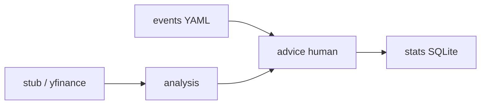

# Архитектура: режим «советник»

Бот **не авторизуется** у брокера и **не отправляет ордера**. Он читает данные (stub или публичный `yfinance`), строит сигнал, переводит его в **простой русский текст**, опционально учитывает **события из YAML-календаря** и записывает каждый новый совет в **SQLite** для последующей оценки.

---

## Поток данных

---

## Модули

| Каталог | Роль |
|---------|------|
| `config/settings.py` | `DATA_DIR`, `DATA_SOURCE`, параметры yfinance |
| `market_data/stub_feed.py` | синтетические бары для тестов |
| `market_data/yfinance_feed.py` | история с Yahoo (опциональная зависимость) |
| `analysis/` | сигналы (сейчас `simple_ma_crossover`) |
| `advice/human.py` | короткие формулировки «для новичков» |
| `events/` | загрузка `events_calendar.yaml`, отбор событий «рядом по времени» |
| `stats/store.py` | запись советов, вердикты `right` / `wrong`, сводка |
| `app/main.py` | прогон истории, смена направления → новый совет → запись |
| `app/stats_cli.py` | CLI оценок и отчёта |

Исполнение ордеров (`execution/`) и заглушка брокера (`broker/`) оставлены в репозитории для возможного расширения, **текущий `main` их не вызывает**.

---

## Статистика точности

Каждая запись имеет `verdict`: `pending` → после тестов выставляется `right` или `wrong` через `fx-pro-stats mark`.

Доля верных считается **только среди оценённых** записей (`accuracy` в `report`).

---

## Docker

Образ ставит пакет с extra `[quotes]`, том `/data` для базы и календаря. См. `Dockerfile` и `docker-compose.yml`.
